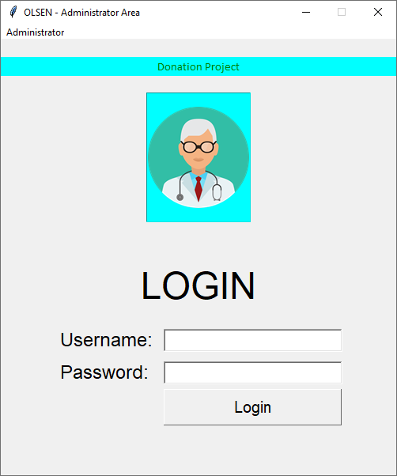
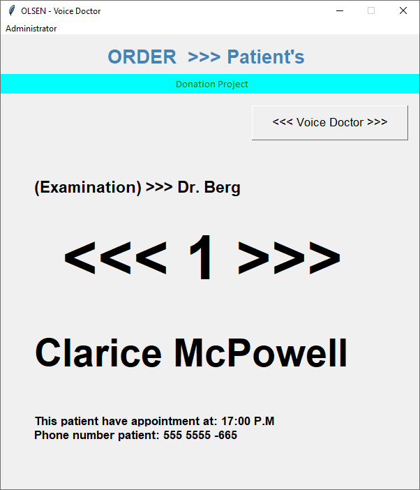
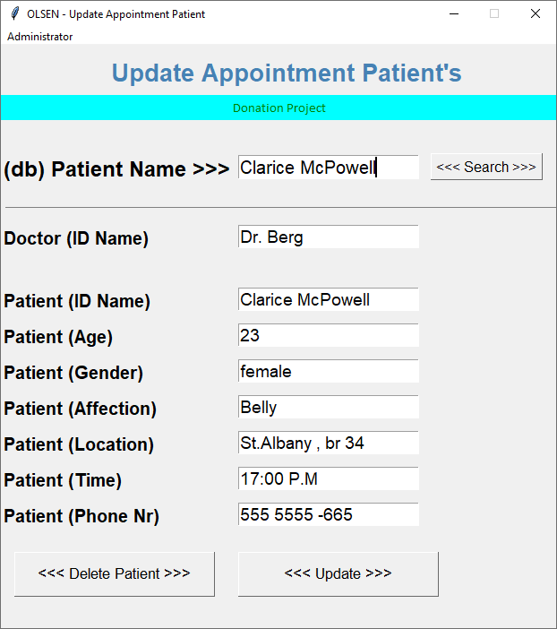
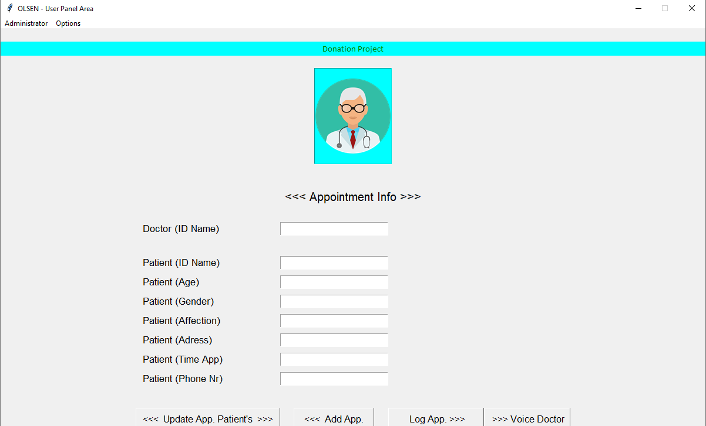

OLSEN - MEDIC LOG MANAGER
=========================

Description Project
------------------

OLSEN - MEDIC LOG MANAGER - It a medical practice management software -
 was developed in Python3 to accommodate the needs of small to mid-size medical center, clinic or hospital

How is Work(demo)
---------------------

YouTube: https://www.youtube.com/watch?v=76_-uaZfFxc&t=200s

Install "dependencies"
------------------------

pip install -r requirements.txt

---------------------------------------

Linux
======

Open Terminal,

make >>> folder root

run this line:

   python3  ./login.py             ---->      (ver. python 3.6 +)

----------------------------------------------------------------------

or

----------------------------------------------------------------------

Windows
============

Open cmd,

make >>> folder root

run this line:

   python login.py             ---->      (ver. python 3.6 +)
   
 or
 
 .exe  double-click  >>>  olsen.exe

======================================================================

Access Admin Panel: (demo user)

user: admin
pass: admin

======================================================================

License & Copyright
--------------------

Licensed under the MIT License

Donation Project
================

Project Name: OLSEN - MEDIC LOG MANAGER.

Etherium:       0x14996EE0113C46A34b14e4F30197768b174c9486

Bitcoin:        1HN7eNRiJFWR1JXQdMx2hwVCaANmbhnUrb

Bitcoin Cash:   qz7h44sqpn8ud2hv04tw2kgr9ayqu94gngm2tedvrt

Tipeeestream:   https://www.tipeeestream.com/rob-giuliano/donation
